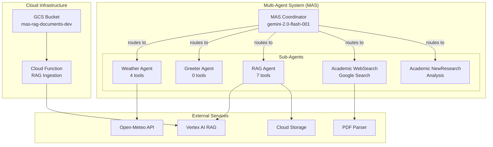

# MAS Visual Component Diagram

## Component Hierarchy



## Tool Distribution

```
┌─────────────────────────────────────────┐
│         TOOL COUNT BY AGENT             │
├─────────────────────────────────────────┤
│                                         │
│ RAG Agent          ████████████████ 7   │
│                                         │
│ Weather Agent      █████████ 4          │
│                                         │
│ Academic Tools     █████ 3              │
│ (Shared Library)                        │
│                                         │
│ Greeter Agent      ─ 0                  │
│                                         │
│ Academic Agents    ─ 0                  │
│ (Use prompts)                           │
│                                         │
│ TOTAL TOOLS: 14 unique tools            │
└─────────────────────────────────────────┘
```

## Request Flow Patterns

### Pattern 1: Direct Tool Execution
```
User Request
     │
     ▼
Coordinator ──→ Agent ──→ Tool ──→ Response
                          │
                          ▼
                    External API
```

### Pattern 2: Multi-Stage Processing
```
User Request
     │
     ▼
Coordinator ──→ Academic Tools ──→ WebSearch Agent
                     │                    │
                     ▼                    ▼
                PDF Parser          Google Search
                                         │
                                         ▼
                                 NewResearch Agent
                                         │
                                         ▼
                                     Response
```

### Pattern 3: Reactive Processing
```
File Upload ──→ GCS Bucket
                    │
                    ▼
              Cloud Function
                    │
                    ▼
               Vertex AI RAG
                    │
                    ▼
            Corpus Updated
                    │
                    ▼
         Available to RAG Agent
```

## System Statistics

```
┌──────────────────────────────────────────────┐
│              SYSTEM METRICS                  │
├──────────────────────────────────────────────┤
│ Total Agents:           6                    │
│ Total Tools:           14                    │
│ External APIs:          3                    │
│ Cloud Functions:        1                    │
│ Storage Buckets:        1                    │
│ RAG Corpora:           1+                    │
│ Test Coverage:       100%                    │
│ Success Rate:        100%                    │
└──────────────────────────────────────────────┘
```

## Technology Stack

```
┌─────────────────────────────────┐
│         TECH STACK              │
├─────────────────────────────────┤
│ Framework:                      │
│   • Google ADK 1.0.0           │
│   • Python 3.9+                │
│                                │
│ AI/ML:                         │
│   • Gemini 2.0 Flash           │
│   • Vertex AI                  │
│   • Text Embedding 005         │
│                                │
│ Cloud:                         │
│   • Cloud Functions (Gen2)      │
│   • Cloud Storage              │
│   • Eventarc                   │
│                                │
│ Libraries:                     │
│   • PyPDF2 (PDF parsing)       │
│   • Requests (API calls)       │
│   • Poetry (dependency mgmt)   │
└─────────────────────────────────┘
```